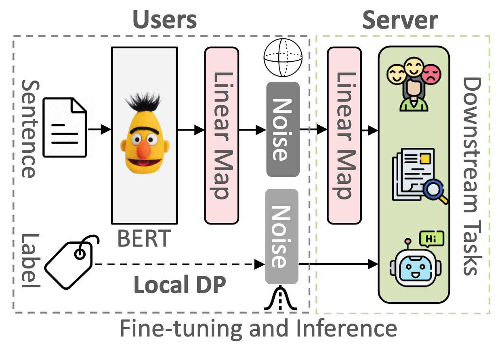

# Sentence-LDP

Code for the WWW'23 paper "Sanitizing Sentence Embeddings (and Labels) for Local Differential Privacy"

DOI for this repo: [](https://zenodo.org/badge/latestdoi/598283362)

Please kindly cite the paper if you use the code or any resources in this repo:

```bib
@inproceedings{www23/DuYCS2023,
  author    = {Minxin Du and Xiang Yue and Sherman S. M. Chow and Huan Sun},
  title     = {Sanitizing Sentence Embeddings (and Labels) for Local Differential Privacy},
  booktitle = {{WWW} '23: The {ACM} Web Conference 2023, AUSTIN, TEXAS, USA,
               April 30 - May 4, 2023},
  year      = {2023},
  }
```

## Introduction

We show how to achieve metric-based local DP (LDP) by sanitizing *sentence embedding (and labels)*
(as opposed to *gradients* in DP-SGD) when fine-tuning pre-trained language models like BERT.

<p align="center">

</p>

## Setup Environment

### Install required packages

```shell
git clone https://github.com/xiangyue9607/Sentence-LDP.git
cd Sentence-LDP
pip install -r requirements.txt
```

## Fine-tune BERT model with Sentence LDP

We then show examples how to fine-tune BERT models to do NLP tasks with Sentence LDP

```bash
python run_glue.py \
--model_name_or_path bert-base-uncased \
--task_name sst2 \
--do_train --do_eval \
--max_seq_length 128 \
--per_device_train_batch_size 32 \
--epsilon1 10.0 --epsilon2 2.0 \
--norm_c 1.0 \
--proj_dim 16 \
--noise_type PurMech \
--learning_rate 2e-5 \
--num_train_epochs 3 \
--output_dir tmp/sst2_ldp/ \
--logging_steps 100 \
--save_steps 2000 \
--overwrite_output_dir \
--overwrite_cache
```

## Membership Inference Attacks

```bash
python attack/membership_inference_attack.py \
--model_name_or_path tmp/sst2_ldp/ \
--task_name sst2 \
--max_seq_length 128 \
--per_device_eval_batch_size 64 \
--overwrite_cache
```

## Sensitive Attribution Attack

```bash
python attack/sensitive_attributes_attack.py --model_name_or_path tmp/sst2_ldp/
```